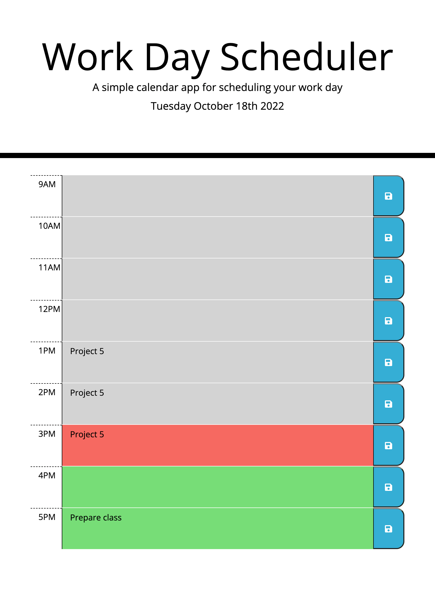

# Work Day Scheduler
Module 5 Challenge
## Description
This application is a daily planner that can help with users's time managemnt. User can save events for each hour of the day (9AM-5PM). This app will run in the browser and feature dynamically updated HTML and CSS powered by jQuery.

[Link](https://zhngzh527.github.io/Work-Day-Scheduler/)

I have using those technologies to create the web application:
- HTML
- CSS
- JavaScript
- Bootstrap
- jQuery
- Moment.js

## Application Screenshot
